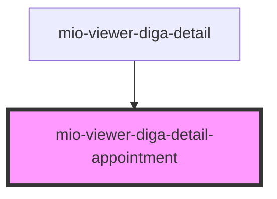

# mio-viewer-diga-detail-appointment

<!-- Auto Generated Below -->

## Properties

| Property                          | Attribute | Description                                                                                               | Type                                                                                                                                             | Default     |
| --------------------------------- | --------- | --------------------------------------------------------------------------------------------------------- | ------------------------------------------------------------------------------------------------------------------------------------------------ | ----------- |
| `appointmentDetails` _(required)_ | --        | Beschreibt einen Termin orientiert an https://fhir.kbv.de/StructureDefinition/KBV_PR_MIO_DIGA_Appointment | `DiGAEntrySummary & { detailType: "Appointment"; categoryName: "Termine"; endDate: string; participant: { actor: string; status: string; }[]; }` | `undefined` |

## Dependencies

### Used by

 - [mio-viewer-diga-detail](../mio-viewer-diga-detail)

### Graph

----------------------------------------------

*Built with [StencilJS](https://stenciljs.com/)*
