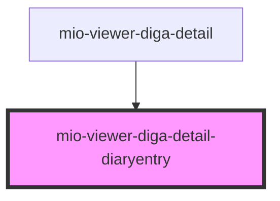

# mio-viewer-diga-detail-diaryentry

<!-- Auto Generated Below -->

## Properties

| Property                         | Attribute | Description                                                                                                                    | Type                                                                                                                                             | Default     |
| -------------------------------- | --------- | ------------------------------------------------------------------------------------------------------------------------------ | ------------------------------------------------------------------------------------------------------------------------------------------------ | ----------- |
| `diaryEntryDetails` _(required)_ | --        | Beschreibt einen Tagebucheintrag orientiert an https://fhir.kbv.de/StructureDefinition/KBV_PR_MIO_DIGA_Observation_Diary_Entry | `DiGAEntrySummary & { detailType: "DiaryEntry"; categoryName: "Patientenberichte"; hasMember: { id: string; name: string; value: string; }[]; }` | `undefined` |

## Dependencies

### Used by

 - [mio-viewer-diga-detail](../mio-viewer-diga-detail)

### Graph

----------------------------------------------

*Built with [StencilJS](https://stenciljs.com/)*
