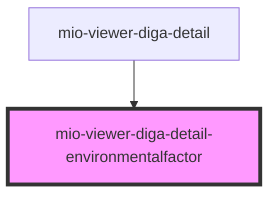

# mio-viewer-diga-detail-environmentalfactor

<!-- Auto Generated Below -->

## Properties

| Property                                  | Attribute | Description                                                                                                                          | Type                                                                                                         | Default     |
| ----------------------------------------- | --------- | ------------------------------------------------------------------------------------------------------------------------------------ | ------------------------------------------------------------------------------------------------------------ | ----------- |
| `environmentalFactorDetails` _(required)_ | --        | Beschreibt einen Umweltfaktor orientiert an https://fhir.kbv.de/StructureDefinition/KBV_PR_MIO_DIGA_Observation_Environmental_Factor | `DiGAEntrySummary & { detailType: "EnvironmentalFactor"; categoryName: "Umweltfaktor"; performer: string; }` | `undefined` |

## Dependencies

### Used by

 - [mio-viewer-diga-detail](../mio-viewer-diga-detail)

### Graph

----------------------------------------------

*Built with [StencilJS](https://stenciljs.com/)*
