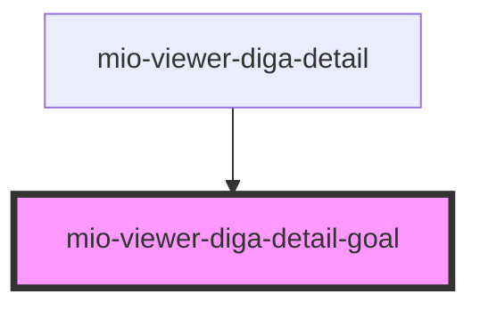

# mio-viewer-diga-detail-goal

<!-- Auto Generated Below -->

## Properties

| Property                   | Attribute | Description                                                                                    | Type                                                                                                                    | Default     |
| -------------------------- | --------- | ---------------------------------------------------------------------------------------------- | ----------------------------------------------------------------------------------------------------------------------- | ----------- |
| `goalDetails` _(required)_ | --        | Beschreibt ein Ziel orientiert an https://fhir.kbv.de/StructureDefinition/KBV_PR_MIO_DIGA_Goal | `DiGAEntrySummary & { detailType: "Goal"; categoryName: "Ziele und Pläne"; description: string; expressedBy: string; }` | `undefined` |

## Dependencies

### Used by

 - [mio-viewer-diga-detail](../mio-viewer-diga-detail)

### Graph

----------------------------------------------

*Built with [StencilJS](https://stenciljs.com/)*
