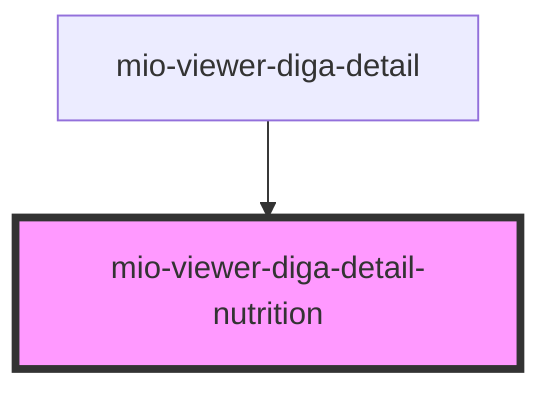

# mio-viewer-diga-detail-nutrition

<!-- Auto Generated Below -->

## Properties

| Property                        | Attribute | Description                                                                                                                                                                                                                                               | Type                                                                                                                | Default     |
| ------------------------------- | --------- | --------------------------------------------------------------------------------------------------------------------------------------------------------------------------------------------------------------------------------------------------------- | ------------------------------------------------------------------------------------------------------------------- | ----------- |
| `nutritionDetails` _(required)_ | --        | Beschreibt eine Nahrungsmittelaufnahme orientiert an https://fhir.kbv.de/StructureDefinition/KBV_PR_MIO_DIGA_Observation_Nutrition_Intake und https://fhir.kbv.de/StructureDefinition/KBV_PR_MIO_DIGA_Observation_Nutrition_Intake_Food_Composition_Types | `DiGAEntrySummary & { detailType: "NutritionIntake"; categoryName: "Nahrung"; parts: DiGANutritionDetailsPart[]; }` | `undefined` |

## Dependencies

### Used by

 - [mio-viewer-diga-detail](../mio-viewer-diga-detail)

### Graph

----------------------------------------------

*Built with [StencilJS](https://stenciljs.com/)*
