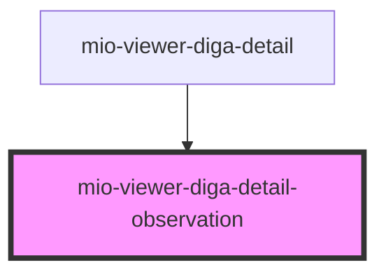

# mio-viewer-diga-detail-observation

<!-- Auto Generated Below -->

## Properties

| Property                          | Attribute | Description                                                                                                                                    | Type                                                                                                     | Default     |
| --------------------------------- | --------- | ---------------------------------------------------------------------------------------------------------------------------------------------- | -------------------------------------------------------------------------------------------------------- | ----------- |
| `observationDetails` _(required)_ | --        | Beschreibt ein freies Ergebnis oder einen freien Befund orientiert an https://fhir.kbv.de/StructureDefinition/KBV_PR_MIO_DIGA_Observation_Free | `DiGAEntrySummary & { detailType: "ObservationFree"; categoryName: "sonstige Befunde und Ergebnisse"; }` | `undefined` |

## Dependencies

### Used by

 - [mio-viewer-diga-detail](../mio-viewer-diga-detail)

### Graph

----------------------------------------------

*Built with [StencilJS](https://stenciljs.com/)*
