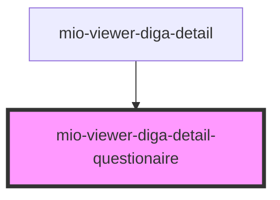

# mio-viewer-diga-detail-questionaire

<!-- Auto Generated Below -->

## Properties

| Property                            | Attribute | Description                                                                                                                                                                                       | Type                                                                                                                                                                         | Default     |
| ----------------------------------- | --------- | ------------------------------------------------------------------------------------------------------------------------------------------------------------------------------------------------- | ---------------------------------------------------------------------------------------------------------------------------------------------------------------------------- | ----------- |
| `questionnaireDetails` _(required)_ | --        | Beschreibt einen Fragebogen orientiert an https://fhir.kbv.de/StructureDefinition/KBV_PR_MIO_DIGA_Questionnaire und https://fhir.kbv.de/StructureDefinition/KBV_PR_MIO_DIGA_QuestionnaireResponse | `DiGAEntrySummary & { detailType: "Questionnaire"; categoryName: "Fragebögen"; publisher: string; purpose: string; questionData: { question: string; answer: string; }[]; }` | `undefined` |

## Dependencies

### Used by

 - [mio-viewer-diga-detail](../mio-viewer-diga-detail)

### Graph

----------------------------------------------

*Built with [StencilJS](https://stenciljs.com/)*
