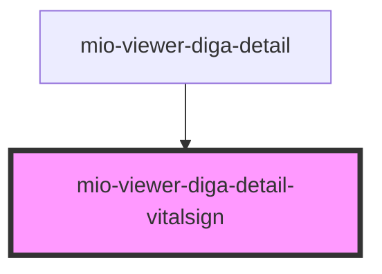

# mio-viewer-diga-detail-vitalsign

<!-- Auto Generated Below -->

## Properties

| Property                        | Attribute | Description                                                                                                                                                                                                     | Type                                                                                                                                                                | Default     |
| ------------------------------- | --------- | --------------------------------------------------------------------------------------------------------------------------------------------------------------------------------------------------------------- | ------------------------------------------------------------------------------------------------------------------------------------------------------------------- | ----------- |
| `vitalSignDetails` _(required)_ | --        | Beschreibt ein Vitalzeichen orientiert an https://fhir.kbv.de/StructureDefinition/KBV_PR_MIO_DIGA_Observation_Blood_Pressure und https://fhir.kbv.de/StructureDefinition/KBV_PR_MIO_DIGA_Observation_Heart_Rate | `DiGAEntrySummary & { detailType: "VitalSign"; categoryName: "Vitalzeichen und Körpermaße"; performer: string; measurements: { name: string; value: string; }[]; }` | `undefined` |

## Dependencies

### Used by

 - [mio-viewer-diga-detail](../mio-viewer-diga-detail)

### Graph

----------------------------------------------

*Built with [StencilJS](https://stenciljs.com/)*
