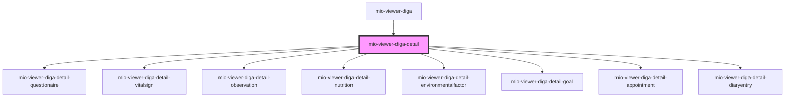

# mio-viewer-diga-detail

<!-- Auto Generated Below -->

## Properties

| Property                    | Attribute    | Description                                        | Type                                                                                                                                                                                                                                                                                                                                                                                                                                                                                                                                                                                                                                                                                                                                                                                                                                                                                                                                                                                                                                                                                                                        | Default     |
| --------------------------- | ------------ | -------------------------------------------------- | --------------------------------------------------------------------------------------------------------------------------------------------------------------------------------------------------------------------------------------------------------------------------------------------------------------------------------------------------------------------------------------------------------------------------------------------------------------------------------------------------------------------------------------------------------------------------------------------------------------------------------------------------------------------------------------------------------------------------------------------------------------------------------------------------------------------------------------------------------------------------------------------------------------------------------------------------------------------------------------------------------------------------------------------------------------------------------------------------------------------------- | ----------- |
| `entryDetails` _(required)_ | --           | Beschreibt die Attribute des ausgewählten Eintrags | `DiGAEntrySummary & { detailType: "Appointment"; categoryName: "Termine"; endDate: string; participant: { actor: string; status: string; }[]; } \| DiGAEntrySummary & { detailType: "DiaryEntry"; categoryName: "Patientenberichte"; hasMember: { id: string; name: string; value: string; }[]; } \| DiGAEntrySummary & { detailType: "EnvironmentalFactor"; categoryName: "Umweltfaktor"; performer: string; } \| DiGAEntrySummary & { detailType: "Goal"; categoryName: "Ziele und Pläne"; description: string; expressedBy: string; } \| DiGAEntrySummary & { detailType: "NutritionIntake"; categoryName: "Nahrung"; parts: DiGANutritionDetailsPart[]; } \| DiGAEntrySummary & { detailType: "ObservationFree"; categoryName: "sonstige Befunde und Ergebnisse"; } \| DiGAEntrySummary & { detailType: "Questionnaire"; categoryName: "Fragebögen"; publisher: string; purpose: string; questionData: { question: string; answer: string; }[]; } \| DiGAEntrySummary & { detailType: "VitalSign"; categoryName: "Vitalzeichen und Körpermaße"; performer: string; measurements: { name: string; value: string; }[]; }` | `undefined` |
| `entryName`                 | `entry-name` | Beschreibt den Namen des ausgewählten Eintrags     | `string`                                                                                                                                                                                                                                                                                                                                                                                                                                                                                                                                                                                                                                                                                                                                                                                                                                                                                                                                                                                                                                                                                                                    | `undefined` |

## Events

| Event           | Description                                                     | Type               |
| --------------- | --------------------------------------------------------------- | ------------------ |
| `detailsHidden` | Event wird ausgelöst, wenn die Detail-Ansischt geschlossen wird | `CustomEvent<any>` |

## Shadow Parts

| Part        | Description |
| ----------- | ----------- |
| `"content"` |             |

## Dependencies

### Used by

 - [mio-viewer-diga](../mio-viewer-diga)

### Depends on

- [mio-viewer-diga-detail-questionaire](../mio-viewer-diga-detail-questionaire)
- [mio-viewer-diga-detail-vitalsign](../mio-viewer-diga-detail-vitalsign)
- [mio-viewer-diga-detail-observation](../mio-viewer-diga-detail-observation)
- [mio-viewer-diga-detail-nutrition](../mio-viewer-diga-detail-nutrition)
- [mio-viewer-diga-detail-environmentalfactor](../mio-viewer-diga-detail-environmentalfactor)
- [mio-viewer-diga-detail-goal](../mio-viewer-diga-detail-goal)
- [mio-viewer-diga-detail-appointment](../mio-viewer-diga-detail-appointment)
- [mio-viewer-diga-detail-diaryentry](../mio-viewer-diga-detail-diaryentry)

### Graph

----------------------------------------------

*Built with [StencilJS](https://stenciljs.com/)*
