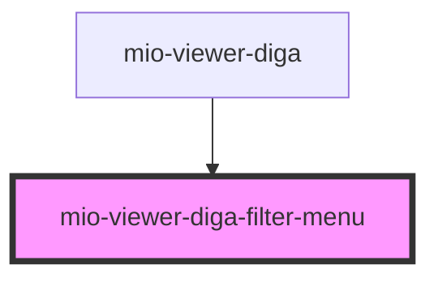

# mio-viewer-diga-filter-menu

<!-- Auto Generated Below -->

## Properties

| Property           | Attribute | Description                                                           | Type       | Default     |
| ------------------ | --------- | --------------------------------------------------------------------- | ---------- | ----------- |
| `filterCategories` | --        | Beschreibt alle Kategorien die innerhalb des Bundles verwendet werden | `string[]` | `undefined` |

## Events

| Event            | Description                                                                                                               | Type                                                         |
| ---------------- | ------------------------------------------------------------------------------------------------------------------------- | ------------------------------------------------------------ |
| `filtersApplied` | Event wird ausgelöst wenn ein Filter-Button geklickt wird, dabei werden die ausgewählten Filter in FilterStates übergeben | `CustomEvent<{ categoryFilters: Record<string, boolean>; }>` |

## Dependencies

### Used by

 - [mio-viewer-diga](../mio-viewer-diga)

### Graph

----------------------------------------------

*Built with [StencilJS](https://stenciljs.com/)*
