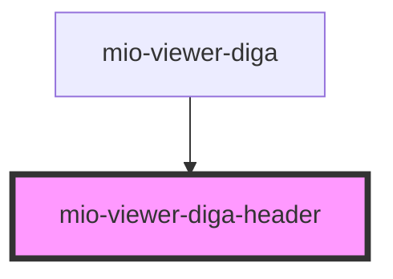

# mio-viewer-diga-header

<!-- Auto Generated Below -->

## Properties

| Property               | Attribute | Description                                                                                              | Type                                                                         | Default     |
| ---------------------- | --------- | -------------------------------------------------------------------------------------------------------- | ---------------------------------------------------------------------------- | ----------- |
| `patient` _(required)_ | --        | Beschreibt einen Patienten orientiert an https://fhir.kbv.de/StructureDefinition/KBV_PR_MIO_DIGA_Patient | `{ name: string; birthDate?: string; identifier: string; gender?: string; }` | `undefined` |

## Dependencies

### Used by

 - [mio-viewer-diga](../mio-viewer-diga)

### Graph

----------------------------------------------

*Built with [StencilJS](https://stenciljs.com/)*
