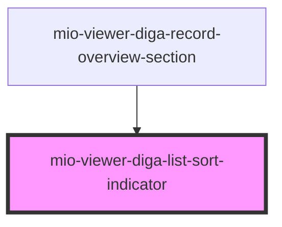

# mio-viewer-diga-list-sort-indicator

<!-- Auto Generated Below -->

## Properties

| Property   | Attribute  | Description                                                          | Type      | Default     |
| ---------- | ---------- | -------------------------------------------------------------------- | --------- | ----------- |
| `active`   | `active`   | Beschreibt ob der Sortier-Zustand einer Liste aktiv ist              | `boolean` | `undefined` |
| `reversed` | `reversed` | Beschreibt ob der Sortier-Zustand einer Liste rückwärts sortiert ist | `boolean` | `undefined` |

## Dependencies

### Used by

 - [mio-viewer-diga-record-overview-section](../mio-viewer-diga-record-overview-section)

### Graph

----------------------------------------------

*Built with [StencilJS](https://stenciljs.com/)*
