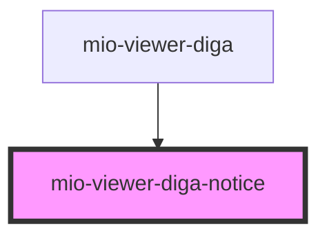

# mio-viewer-diga-notice

<!-- Auto Generated Below -->

## Events

| Event         | Description                                                                                              | Type               |
| ------------- | -------------------------------------------------------------------------------------------------------- | ------------------ |
| `noticeClose` | Emitted when user closes the modal.  A parent component should listen to this event and close the popup. | `CustomEvent<any>` |

## Dependencies

### Used by

 - [mio-viewer-diga](../mio-viewer-diga)

### Graph

----------------------------------------------

*Built with [StencilJS](https://stenciljs.com/)*
