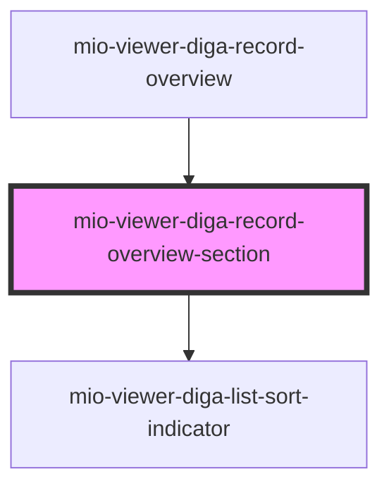

# mio-viewer-diga-record-overview-section

<!-- Auto Generated Below -->

## Properties

| Property                | Attribute        | Description                                                           | Type                                                                                            | Default     |
| ----------------------- | ---------------- | --------------------------------------------------------------------- | ----------------------------------------------------------------------------------------------- | ----------- |
| `recordSummaryCategory` | --               | Beschreibt eine Liste der gesamten Einträgen nach Kategorien sortiert | `{ name: string; dataDescription: string; showDetails: boolean; entries: DiGAEntrySummary[]; }` | `undefined` |
| `selectedEntry`         | `selected-entry` | Beschreibt den vom Nutzer ausgewählten Eintrag innerhalb der Liste    | `string`                                                                                        | `undefined` |

## Events

| Event           | Description                                                                                                      | Type                  |
| --------------- | ---------------------------------------------------------------------------------------------------------------- | --------------------- |
| `entrySelected` | Event wird ausgelöst sobald der Nutzer einen Eintrag auswählt dabei wird id des ausgewählten Eintrags übertragen | `CustomEvent<string>` |

## Dependencies

### Used by

 - [mio-viewer-diga-record-overview](../mio-viewer-diga-record-overview)

### Depends on

- [mio-viewer-diga-list-sort-indicator](../mio-viewer-diga-list-sort-indicator)

### Graph

----------------------------------------------

*Built with [StencilJS](https://stenciljs.com/)*
