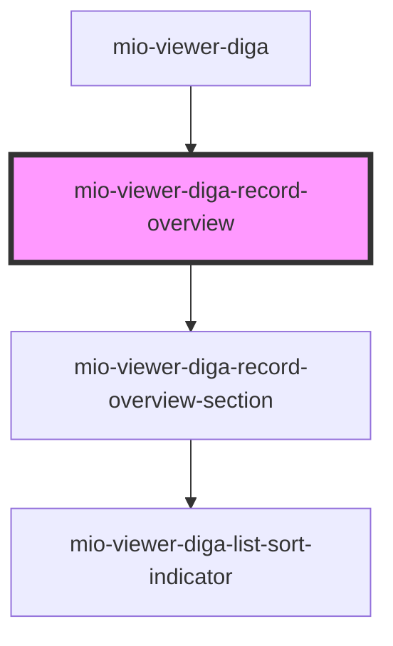

# mio-viewer-diga-record-overview

<!-- Auto Generated Below -->

## Properties

| Property                  | Attribute        | Description                                                           | Type                         | Default     |
| ------------------------- | ---------------- | --------------------------------------------------------------------- | ---------------------------- | ----------- |
| `recordSummaryCategories` | --               | Beschreibt eine Liste der gesamten Einträgen nach Kategorien sortiert | `DiGAEntrySummaryCategory[]` | `undefined` |
| `selectedEntry`           | `selected-entry` | Beschreibt den vom Nutzer ausgewählten Eintrag innerhalb der Liste    | `string`                     | `undefined` |

## Dependencies

### Used by

 - [mio-viewer-diga](../mio-viewer-diga)

### Depends on

- [mio-viewer-diga-record-overview-section](../mio-viewer-diga-record-overview-section)

### Graph

----------------------------------------------

*Built with [StencilJS](https://stenciljs.com/)*
