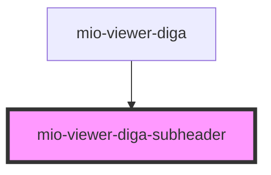

# mio-viewer-diga-subheader

<!-- Auto Generated Below -->

## Properties

| Property | Attribute | Description                                                                                            | Type                                                                                                                                 | Default                                                                                                                                                                                            |
| -------- | --------- | ------------------------------------------------------------------------------------------------------ | ------------------------------------------------------------------------------------------------------------------------------------ | -------------------------------------------------------------------------------------------------------------------------------------------------------------------------------------------------- |
| `diga`   | --        | Beschreibt eine DiGA orientiert an https://fhir.kbv.de/StructureDefinition/KBV_PR_MIO_DIGA_Device_DIGA | `{ diGAName: string; prescriber: string; startDate: string; endDate: string; status: string; version: string; lastUpdate: string; }` | `{     diGAName: "actensio App",     prescriber: "Dr. Müller",     startDate: "01.01.2024",     endDate: "31.06.2024",     status: "aktiv",     version: "1.0",     lastUpdate: "06.06.2024",   }` |

## Events

| Event        | Description                                                | Type               |
| ------------ | ---------------------------------------------------------- | ------------------ |
| `noticeOpen` | Event wird ausgelöst, wenn der Nutzer den Hinweis anklickt | `CustomEvent<any>` |

## Dependencies

### Used by

 - [mio-viewer-diga](../mio-viewer-diga)

### Graph

----------------------------------------------

*Built with [StencilJS](https://stenciljs.com/)*
