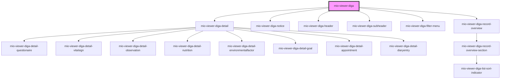

# mio-viewer-diga

<!-- Auto Generated Below -->

## Properties

| Property                      | Attribute            | Description | Type     | Default     |
| ----------------------------- | -------------------- | ----------- | -------- | ----------- |
| `base64FhirData` _(required)_ | `base-6-4-fhir-data` |             | `string` | `undefined` |

## Dependencies

### Depends on

- [mio-viewer-diga-detail](../mio-viewer-diga-detail)
- [mio-viewer-diga-notice](../mio-viewer-diga-notice)
- [mio-viewer-diga-header](../mio-viewer-diga-header)
- [mio-viewer-diga-subheader](../mio-viewer-diga-subheader)
- [mio-viewer-diga-filter-menu](../mio-viewer-diga-filter-menu)
- [mio-viewer-diga-record-overview](../mio-viewer-diga-record-overview)

### Graph

----------------------------------------------

*Built with [StencilJS](https://stenciljs.com/)*
